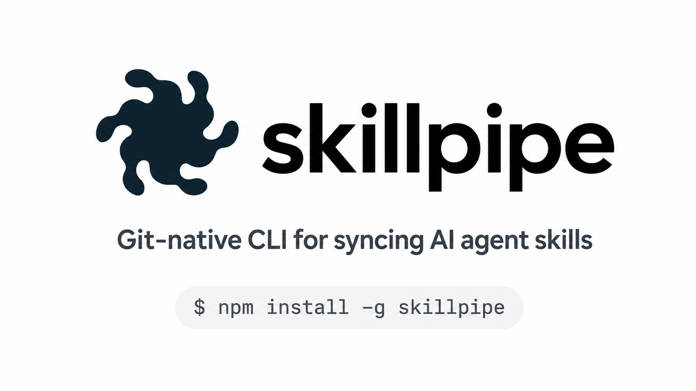

# SkillSync

> Git-native CLI for syncing AI agent skills across environments.



[](https://www.npmjs.com/package/skillpipe)
[](https://github.com/levante-hub/skillpipe/actions/workflows/ci.yml)
[](https://opensource.org/licenses/MIT)

**SkillSync is a CLI built for AI agents.** Define your agent skills once in a GitHub
repository, install them into Claude Code (and other agent environments via adapters),
keep them updated with a single command, and let agents propose improvements through
Pull Requests.

```bash
npm install -g skillpipe
skillsync init
skillsync repo connect https://github.com/<you>/my-agent-skills
skillsync install brand-analysis
```

---

## Documentation

Full documentation lives under [`docs/`](./docs/README.md):

- [Getting started](./docs/getting-started.md) — install, init, connect a repo, install skills.
- [For agents](./docs/agents.md) — why SkillSync is built for AI agents and how they consume skills.
- [Commands reference](./docs/commands.md) — every command, every flag.
- [Skill format](./docs/skill-format.md) — `SKILL.md` frontmatter and body.
- [Targets & adapters](./docs/targets.md) — Claude Code, custom paths, future adapters.
- [Security model](./docs/security.md) — validation, secrets, PR-only flow.
- [Contributing](./docs/contributing.md) — project setup, code style, PR flow.
- [Adding a new adapter](./docs/adapters.md) — support a new agent target (Cursor, Codex, your own).

---

## License

MIT — see [LICENSE](./LICENSE).
